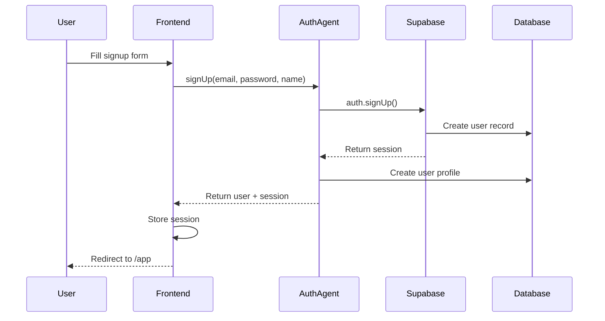
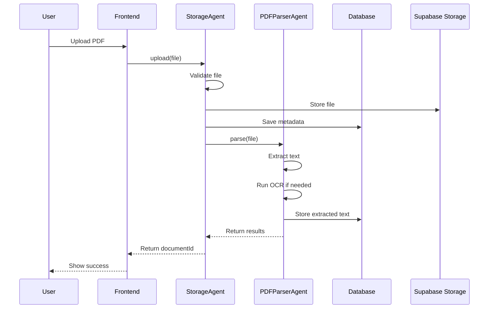
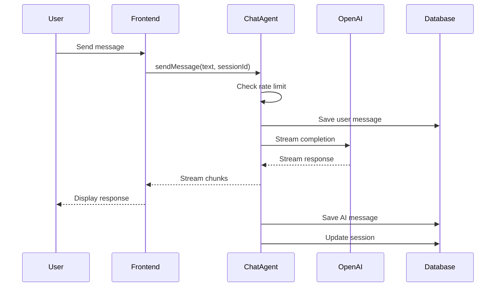
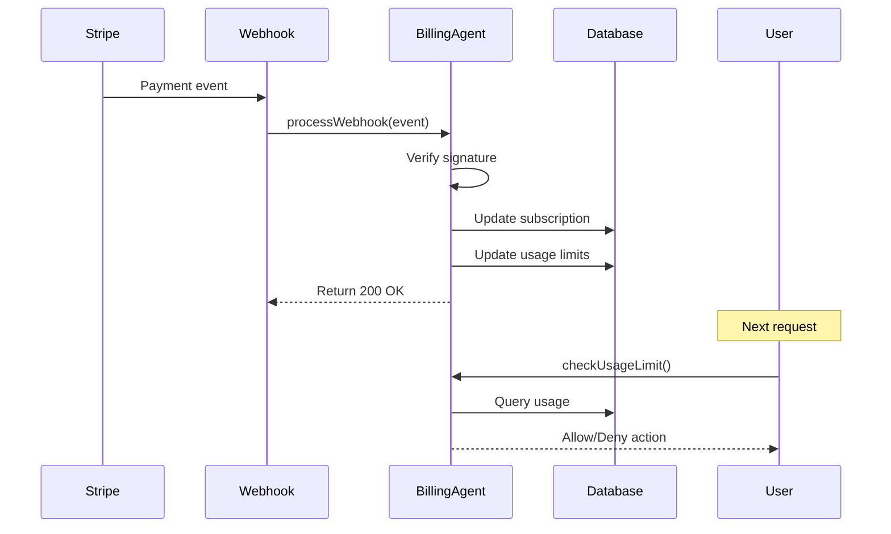
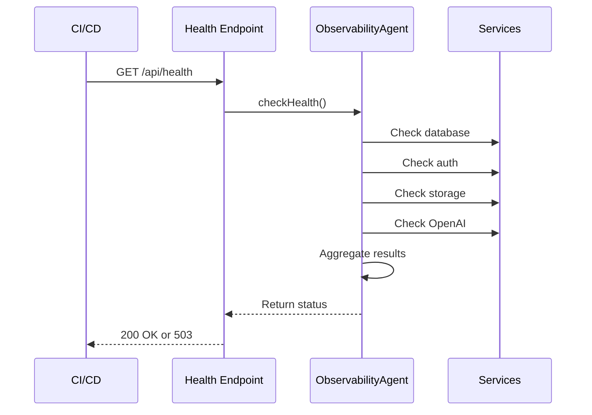

# OM Intel Chat - AI Agents Documentation

## 📋 Overview

### Purpose of `agents.md`

This document provides a comprehensive reference for all AI agents and service components within the OM Intel Chat platform. It serves as a single source of truth for understanding how each autonomous component operates, integrates, and contributes to the overall system functionality.

### High-level Architecture

OM Intel Chat follows a modular agent-based architecture where specialized components handle distinct responsibilities:

```
┌─────────────────┐     ┌─────────────────┐     ┌─────────────────┐
│   AuthAgent     │     │  ChatAgent      │     │ PDFParserAgent  │
└────────┬────────┘     └────────┬────────┘     └────────┬────────┘
         │                       │                        │
         └───────────────────────┴────────────────────────┘
                                 │
                        ┌────────▼────────┐
                        │  Orchestrator   │
                        │   (API Routes)  │
                        └────────┬────────┘
                                 │
         ┌───────────────────────┴────────────────────────┐
         │                       │                        │
┌────────▼────────┐     ┌────────▼────────┐     ┌────────▼────────┐
│  BillingAgent   │     │ StorageAgent    │     │ObservabilityAgent│
└─────────────────┘     └─────────────────┘     └─────────────────┘
```

## 🤖 Agent Definitions

### 1. AuthAgent

**Responsibilities:**
- User authentication and authorization
- Session management
- JWT token validation
- Password reset workflows
- User profile management

**Inputs & Outputs:**
| Input | Type | Output | Type |
|-------|------|--------|------|
| email | string | user | User object |
| password | string | session | Session object |
| token | string | isValid | boolean |
| userId | string | profile | UserProfile |

**Integration Points:**
- Supabase Auth service
- `/api/auth/*` endpoints
- `AuthContext` React context
- Protected route components

**Configuration:**
```env
NEXT_PUBLIC_SUPABASE_URL=https://xxx.supabase.co
NEXT_PUBLIC_SUPABASE_ANON_KEY=xxx
SUPABASE_SERVICE_ROLE_KEY=xxx
```

**Example Code:**
```typescript
// Authenticate user
import { AuthAgent } from '@/lib/agents/auth'

const authAgent = new AuthAgent()
const { user, session, error } = await authAgent.signIn({
  email: 'user@example.com',
  password: 'securepassword'
})

// Validate token
const isValid = await authAgent.validateToken(token)
```

### 2. PDFParserAgent

**Responsibilities:**
- PDF file validation
- Text extraction from digital PDFs
- OCR processing for scanned documents
- Metadata extraction
- Document chunking for analysis

**Inputs & Outputs:**
| Input | Type | Output | Type |
|-------|------|--------|------|
| file | File/Buffer | text | string |
| documentId | string | metadata | DocumentMetadata |
| options | ParseOptions | chunks | TextChunk[] |

**Integration Points:**
- `/api/upload` endpoint
- Supabase Storage
- PDF parsing libraries (pdf-parse/pdfjs-dist)
- Tesseract.js for OCR
- Document analysis pipeline

**Configuration:**
```env
MAX_FILE_SIZE=10485760  # 10MB
ALLOWED_MIME_TYPES=application/pdf
OCR_CONFIDENCE_THRESHOLD=0.8
CHUNK_SIZE=1000  # tokens
```

**Example Code:**
```typescript
// Parse PDF document
import { PDFParserAgent } from '@/lib/agents/pdf-parser'

const pdfParser = new PDFParserAgent()
const result = await pdfParser.parse({
  file: uploadedFile,
  options: {
    extractTables: true,
    performOCR: true,
    chunkSize: 1000
  }
})

// Result structure
{
  text: "Full document text...",
  metadata: {
    pages: 10,
    title: "Lease Agreement",
    author: "John Doe",
    createdAt: "2024-01-01"
  },
  chunks: [
    { id: 1, text: "First chunk...", page: 1 },
    { id: 2, text: "Second chunk...", page: 2 }
  ],
  tables: [
    { page: 3, data: [[...]] }
  ]
}
```

### 3. ChatAgent

**Responsibilities:**
- Message routing and processing
- OpenAI API integration
- Context management
- Response streaming
- Conversation persistence
- Rate limiting enforcement

**Inputs & Outputs:**
| Input | Type | Output | Type |
|-------|------|--------|------|
| message | string | response | string (streamed) |
| sessionId | string | messageId | string |
| context | Message[] | tokens | number |
| userId | string | session | ChatSession |

**Integration Points:**
- `/api/chat` and `/api/chat-enhanced` endpoints
- OpenAI GPT-4 API
- Supabase database (messages, chat_sessions)
- Rate limiting middleware
- WebSocket for real-time updates

**Configuration:**
```env
OPENAI_API_KEY=sk-xxx
OPENAI_MODEL=gpt-4
MAX_TOKENS=2000
TEMPERATURE=0.7
RATE_LIMIT_REQUESTS=20
RATE_LIMIT_WINDOW=60  # seconds
```

**Example Code:**
```typescript
// Send message with ChatAgent
import { ChatAgent } from '@/lib/agents/chat'

const chatAgent = new ChatAgent()
const stream = await chatAgent.sendMessage({
  message: "Analyze this lease agreement",
  sessionId: "session-123",
  userId: "user-456",
  context: previousMessages
})

// Handle streaming response
for await (const chunk of stream) {
  console.log(chunk.content)
}
```

### 4. BillingAgent

**Responsibilities:**
- Subscription management
- Usage tracking and enforcement
- Stripe integration
- Plan upgrades/downgrades
- Invoice generation
- Payment method management

**Inputs & Outputs:**
| Input | Type | Output | Type |
|-------|------|--------|------|
| userId | string | subscription | Subscription |
| planId | string | usage | UsageMetrics |
| paymentMethod | PaymentMethod | invoice | Invoice |
| webhookEvent | StripeEvent | status | BillingStatus |

**Integration Points:**
- Stripe API
- `/api/billing/*` endpoints
- Supabase subscriptions table
- Usage tracking middleware
- Webhook handlers

**Configuration:**
```env
STRIPE_SECRET_KEY=sk_xxx
STRIPE_WEBHOOK_SECRET=whsec_xxx
STRIPE_PRICE_STARTER=price_xxx
STRIPE_PRICE_PRO=price_xxx
STRIPE_PRICE_ENTERPRISE=price_xxx
```

**Example Code:**
```typescript
// Check subscription and usage
import { BillingAgent } from '@/lib/agents/billing'

const billingAgent = new BillingAgent()

// Get current subscription
const subscription = await billingAgent.getSubscription(userId)

// Check usage limits
const canUpload = await billingAgent.checkUsageLimit(userId, 'documents')

// Create checkout session
const { url } = await billingAgent.createCheckoutSession({
  userId,
  priceId: 'price_pro',
  successUrl: '/app',
  cancelUrl: '/pricing'
})
```

### 5. StorageAgent

**Responsibilities:**
- File upload validation
- Secure storage management
- Signed URL generation
- File metadata tracking
- Virus scanning integration
- Storage quota enforcement

**Inputs & Outputs:**
| Input | Type | Output | Type |
|-------|------|--------|------|
| file | File | documentId | string |
| userId | string | signedUrl | string |
| documentId | string | metadata | FileMetadata |
| ttl | number | success | boolean |

**Integration Points:**
- Supabase Storage
- `/api/upload` endpoint
- `/api/storage/*` endpoints
- Document processing pipeline
- Virus scanning service (future)

**Configuration:**
```env
STORAGE_BUCKET=documents
MAX_FILE_SIZE=10485760
SIGNED_URL_TTL=300  # 5 minutes
ALLOWED_EXTENSIONS=.pdf
```

**Example Code:**
```typescript
// Upload and retrieve documents
import { StorageAgent } from '@/lib/agents/storage'

const storageAgent = new StorageAgent()

// Upload document
const { documentId, path } = await storageAgent.upload({
  file: pdfFile,
  userId: 'user-123',
  metadata: {
    name: 'lease-agreement.pdf',
    type: 'lease'
  }
})

// Get signed URL for download
const signedUrl = await storageAgent.getSignedUrl({
  documentId,
  userId: 'user-123',
  ttl: 300  // 5 minutes
})
```

### 6. ObservabilityAgent

**Responsibilities:**
- Health monitoring
- Service status checks
- Performance metrics collection
- Error tracking and alerting
- Audit logging
- CI/CD smoke testing

**Inputs & Outputs:**
| Input | Type | Output | Type |
|-------|------|--------|------|
| service | string | status | HealthStatus |
| metrics | MetricData | report | HealthReport |
| error | Error | logged | boolean |
| event | AuditEvent | tracked | boolean |

**Integration Points:**
- `/api/health` endpoint
- Monitoring services (future: Sentry, DataDog)
- Supabase connection pools
- OpenAI API status
- GitHub Actions CI

**Configuration:**
```env
HEALTH_CHECK_INTERVAL=60  # seconds
ERROR_REPORTING_ENABLED=true
SENTRY_DSN=https://xxx@sentry.io/xxx
METRICS_ENDPOINT=/api/metrics
```

**Example Code:**
```typescript
// Health monitoring
import { ObservabilityAgent } from '@/lib/agents/observability'

const observer = new ObservabilityAgent()

// Check system health
const health = await observer.checkHealth()
/*
{
  status: 'healthy',
  services: {
    database: 'healthy',
    auth: 'healthy',
    storage: 'healthy',
    openai: 'healthy'
  },
  timestamp: '2024-01-01T00:00:00Z'
}
*/

// Log audit event
await observer.logEvent({
  type: 'document.uploaded',
  userId: 'user-123',
  metadata: { documentId: 'doc-456' }
})
```

## 🔄 Interaction Flows

### User Signup Flow



### PDF Processing Flow



### Chat Flow



### Billing Flow



### Health Check Flow



## ⚙️ Configuration & Deployment

### Required Environment Variables

| Agent | Variable | Description | Required |
|-------|----------|-------------|----------|
| **All** | `NODE_ENV` | Environment (development/production) | ✅ |
| **AuthAgent** | `NEXT_PUBLIC_SUPABASE_URL` | Supabase project URL | ✅ |
| | `NEXT_PUBLIC_SUPABASE_ANON_KEY` | Public anonymous key | ✅ |
| | `SUPABASE_SERVICE_ROLE_KEY` | Service role key | ✅ |
| **PDFParserAgent** | `MAX_FILE_SIZE` | Max upload size in bytes | ⚪ |
| | `OCR_ENABLED` | Enable OCR processing | ⚪ |
| **ChatAgent** | `OPENAI_API_KEY` | OpenAI API key | ✅ |
| | `OPENAI_MODEL` | Model to use (gpt-4) | ⚪ |
| | `RATE_LIMIT_REQUESTS` | Requests per window | ⚪ |
| **BillingAgent** | `STRIPE_SECRET_KEY` | Stripe secret key | ✅ |
| | `STRIPE_WEBHOOK_SECRET` | Webhook endpoint secret | ✅ |
| | `STRIPE_PRICE_*` | Price IDs for plans | ✅ |
| **StorageAgent** | `STORAGE_BUCKET` | Bucket name | ⚪ |
| | `SIGNED_URL_TTL` | URL expiration (seconds) | ⚪ |
| **ObservabilityAgent** | `SENTRY_DSN` | Error tracking DSN | ⚪ |
| | `HEALTH_CHECK_INTERVAL` | Check frequency | ⚪ |

### Network Requirements

- **Outbound**: 
  - `api.openai.com` (ChatAgent)
  - `api.stripe.com` (BillingAgent)
  - `*.supabase.co` (All agents)
  - `sentry.io` (ObservabilityAgent)

- **Inbound**:
  - Stripe webhooks from `stripe.com`
  - Health checks from monitoring services

### Setup Script Hooks

```bash
# Initialize all agents
npm run agents:init

# Run agent tests
npm run agents:test

# Generate agent documentation
npm run agents:docs
```

### CI/CD Triggers

```yaml
# .github/workflows/agents.yml
on:
  push:
    paths:
      - 'src/lib/agents/**'
      - 'agents.md'
```

## 🔧 Extension Guide

### Adding a New Agent

1. **Create agent directory structure:**
```
src/lib/agents/
└── new-agent/
    ├── index.ts         # Main agent class
    ├── types.ts         # TypeScript types
    ├── config.ts        # Configuration
    └── __tests__/       # Unit tests
        └── index.test.ts
```

2. **Define agent interface:**
```typescript
// src/lib/agents/new-agent/types.ts
export interface INewAgent {
  initialize(): Promise<void>
  execute(input: NewAgentInput): Promise<NewAgentOutput>
  cleanup(): Promise<void>
}

export interface NewAgentInput {
  // Define input structure
}

export interface NewAgentOutput {
  // Define output structure
}
```

3. **Implement agent class:**
```typescript
// src/lib/agents/new-agent/index.ts
import { INewAgent, NewAgentInput, NewAgentOutput } from './types'
import { config } from './config'

export class NewAgent implements INewAgent {
  private config = config

  async initialize(): Promise<void> {
    // Setup logic
  }

  async execute(input: NewAgentInput): Promise<NewAgentOutput> {
    // Main logic
  }

  async cleanup(): Promise<void> {
    // Cleanup logic
  }
}
```

4. **Register in orchestrator:**
```typescript
// src/lib/agents/orchestrator.ts
import { NewAgent } from './new-agent'

export const agents = {
  auth: new AuthAgent(),
  pdf: new PDFParserAgent(),
  chat: new ChatAgent(),
  billing: new BillingAgent(),
  storage: new StorageAgent(),
  observability: new ObservabilityAgent(),
  newAgent: new NewAgent()  // Add here
}
```

5. **Add API endpoint if needed:**
```typescript
// src/pages/api/new-agent.ts
import { withAuth } from '@/lib/auth-middleware'
import { agents } from '@/lib/agents/orchestrator'

async function handler(req, res) {
  const result = await agents.newAgent.execute(req.body)
  res.json(result)
}

export default withAuth(handler)
```

### Naming Conventions

- **Agent Classes**: PascalCase with "Agent" suffix (e.g., `EmailAgent`)
- **Methods**: camelCase verbs (e.g., `sendEmail`, `validateAddress`)
- **Config Keys**: SCREAMING_SNAKE_CASE (e.g., `EMAIL_PROVIDER`)
- **Types/Interfaces**: PascalCase with "I" prefix for interfaces
- **Files**: kebab-case (e.g., `email-agent/index.ts`)

### Best Practices

1. **Single Responsibility**: Each agent should have one clear purpose
2. **Error Handling**: Always catch and properly handle errors
3. **Logging**: Use structured logging for debugging
4. **Testing**: Maintain >80% test coverage
5. **Documentation**: Update this file when adding agents
6. **Configuration**: Use environment variables, never hardcode
7. **Rate Limiting**: Implement where external APIs are called
8. **Monitoring**: Add health checks and metrics

---

<div align="center">
  📚 Keep this document updated as agents evolve
</div>